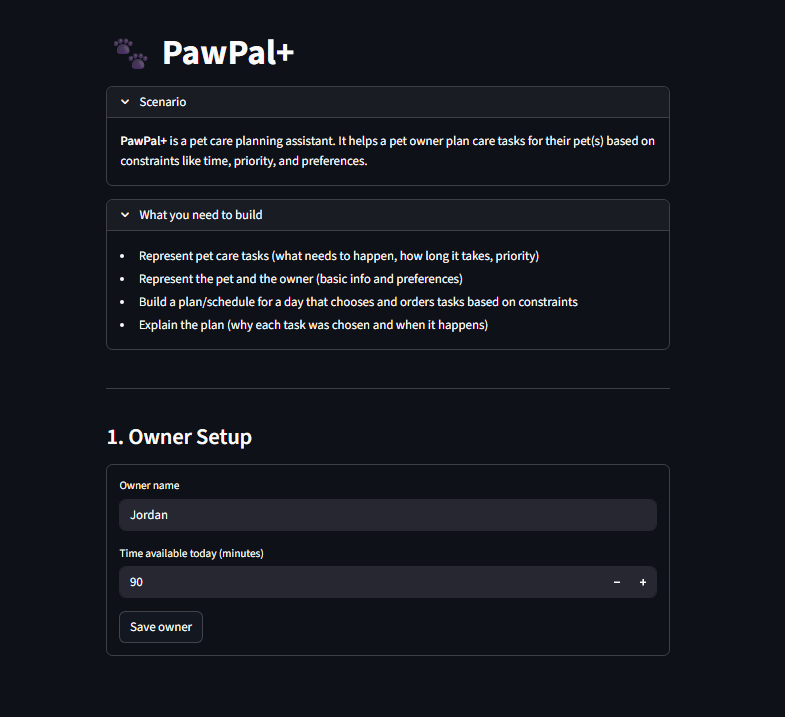

# PawPal+

A Streamlit app that helps pet owners build a smart daily care schedule. Enter your pets, add their tasks, and PawPal+ generates a prioritized plan — detecting conflicts, handling recurring chores, and explaining every scheduling decision.

---

## Demo

<a href="pawpal_demo.png" target="_blank"></a>

---

## Features

### Priority-based scheduling
Tasks are sorted **high → medium → low** priority. Within the same priority tier, shorter tasks are scheduled first so the maximum number of tasks fits inside the available time window (greedy algorithm).

### Sort by time
Any task list can be ordered chronologically by its `HH:MM` start time using `Scheduler.sort_by_time()`. Lexicographic comparison on zero-padded strings means no date library is needed — `"07:30" < "08:00"` just works.

### Daily recurrence
Completing a `"daily"` task with `Scheduler.mark_task_complete()` automatically queues a fresh copy due **tomorrow** (`timedelta(days=1)`). Weekly tasks reschedule **7 days out**. `"as-needed"` tasks never recur automatically.

### Conflict warnings
`Scheduler.detect_conflicts()` checks three conditions before the schedule is built:
- Two or more tasks share the same `HH:MM` start time → flagged as a **time-slot collision**
- Total high-priority task time across all pets exceeds available minutes → **budget warning**
- Any single pet's full workload exceeds available minutes → **per-pet budget warning**

Warnings are returned as plain strings (the program never crashes) and displayed in the UI as `st.error` (time conflicts) or `st.warning` (budget overruns).

### Weekly deprioritization
Tasks with `frequency="weekly"` are always evaluated **after** all daily tasks during `build_plan()`. This guarantees that routine daily care (feeding, walks) is never bumped by lower-urgency weekly chores (grooming, nail trim).

### Filter by pet or status
- `Scheduler.filter_by_pet(pet_name)` — all tasks for one pet
- `Scheduler.filter_tasks(tasks, status)` — narrow any list to `"pending"` or `"completed"`

### Transparent reasoning
Every `DayPlan` carries a full explanation via `plan.explain()`: which tasks were scheduled, which were skipped, and exactly why (e.g. `"only 5 min left, needs 20 min"` or `"weekly task deprioritized"`).

---

## Getting started

### Requirements

- Python 3.11+
- Streamlit, pytest (see `requirements.txt`)

### Setup

```bash
python -m venv .venv
source .venv/bin/activate   # Windows: .venv\Scripts\activate
pip install -r requirements.txt
```

### Run the app

```bash
streamlit run app.py
```

### Run the CLI demo

```bash
python main.py
```

---

## Project structure

```
pawpal_system.py   Core classes: Task, Pet, Owner, DayPlan, Scheduler
app.py             Streamlit UI
main.py            CLI demo showing sorting, filtering, and conflict detection
tests/
  test_pawpal.py   Automated test suite (18 tests)
reflection.md      Design decisions, tradeoffs, and UML diagram
uml_final.mmd      Mermaid source for the final class diagram
```

---

## Smarter Scheduling — method reference

| Feature | Method | Description |
|---|---|---|
| **Sort by time** | `Scheduler.sort_by_time(tasks)` | Chronological HH:MM sort; untimed tasks placed last |
| **Filter by pet** | `Scheduler.filter_by_pet(pet_name)` | All tasks for one named pet |
| **Filter by status** | `Scheduler.filter_tasks(tasks, status)` | `"pending"` or `"completed"` |
| **Recurring tasks** | `Task.next_occurrence()` / `Scheduler.mark_task_complete(pet, task)` | Auto-queues next occurrence via `timedelta` |
| **Conflict detection** | `Scheduler.detect_conflicts()` | Time-slot collisions + budget overruns, returned as warning strings |
| **Weekly deprioritization** | `Scheduler.build_plan()` | Daily tasks always scheduled before weekly ones |

---

## Testing PawPal+

```bash
python -m pytest
```

**18 tests — all passing.**

| Category | Tests | What is verified |
|---|---|---|
| **Sorting** | 4 | Chronological order, untimed tasks last, priority order, duration tiebreak |
| **Recurrence** | 4 | Daily +1 day, weekly +7 days, `as-needed` returns None, pet list grows |
| **Conflict detection** | 3 | Duplicate times warn, different times don't, budget overrun warns |
| **Edge cases** | 4 | Empty pet, task skipped on overflow, filter pending, filter completed |
| **Baseline** | 2 | `mark_complete()` flips status, `add_task()` grows task list |

**Confidence level: ★★★★☆**
All algorithmic paths are covered. The remaining gap is integration-level testing of the Streamlit UI layer.
