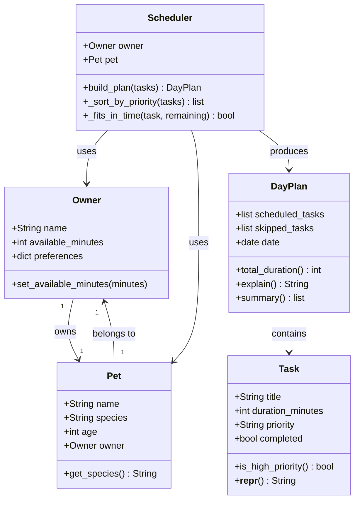

# PawPal+ Project Reflection

## 1. System Design

**a. Initial design**

My initial design centers on three core user actions:

- **Enter owner and pet info**: The user provides their name, pet name/type, and how much time they have available each day. This gives the scheduler the context it needs to make realistic plans.
- **Add and edit care tasks**: The user builds a task list of pet care activities (walks, feeding, medications, enrichment, grooming, etc.), each tagged with an estimated duration and a priority level. Tasks can be added, updated, or removed at any time.
- **Generate the daily plan**: The user triggers schedule generation. The app fits tasks into the available time window, ordered by priority, and displays the resulting plan with a brief explanation of why certain tasks were included or deferred.

Classes I anticipated: `Pet`, `Owner`, `Task`, and `Scheduler`. `Scheduler` holds the core planning logic; the others are data containers.

### UML Class Diagram

**b. Design changes**

- Did your design change during implementation?
- If yes, describe at least one change and why you made it.

---

## 2. Scheduling Logic and Tradeoffs

**a. Constraints and priorities**

- What constraints does your scheduler consider (for example: time, priority, preferences)?
- How did you decide which constraints mattered most?

**b. Tradeoffs**

- Describe one tradeoff your scheduler makes.
- Why is that tradeoff reasonable for this scenario?

---

## 3. AI Collaboration

**a. How you used AI**

- How did you use AI tools during this project (for example: design brainstorming, debugging, refactoring)?
- What kinds of prompts or questions were most helpful?

**b. Judgment and verification**

- Describe one moment where you did not accept an AI suggestion as-is.
- How did you evaluate or verify what the AI suggested?

---

## 4. Testing and Verification

**a. What you tested**

- What behaviors did you test?
- Why were these tests important?

**b. Confidence**

- How confident are you that your scheduler works correctly?
- What edge cases would you test next if you had more time?

---

## 5. Reflection

**a. What went well**

- What part of this project are you most satisfied with?

**b. What you would improve**

- If you had another iteration, what would you improve or redesign?

**c. Key takeaway**

- What is one important thing you learned about designing systems or working with AI on this project?
