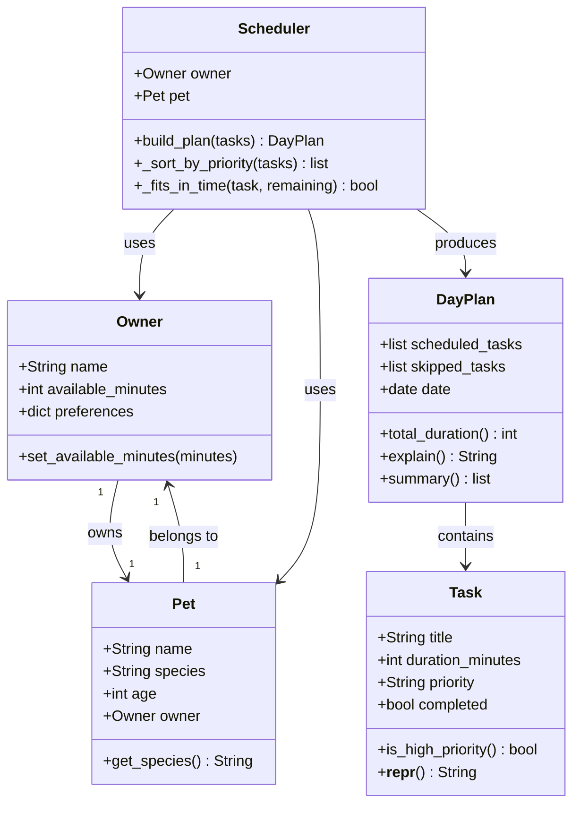

# PawPal+ Project Reflection

## 1. System Design

**a. Initial design**

Classes I chose and their responsibilities:

- **`Owner`** — holds the human side of the relationship: name, how many minutes are available today, and any scheduling preferences (e.g. prefers morning walks). It is the primary constraint source for the scheduler.
- **`Pet`** — holds the animal's profile (name, species, age) and a reference to its owner. It carries context the scheduler may use to personalize the plan (e.g. a senior dog needs shorter walks).
- **`Task`** — represents a single care activity. It stores what needs to happen (`title`), how long it takes (`duration_minutes`), how important it is (`priority`), whether it was done (`completed`), and if skipped, why (`reason_skipped`). It is the unit the scheduler operates on.
- **`DayPlan`** — the output of a scheduling run. It holds the ordered list of scheduled tasks, the list of skipped tasks (with reasons), and references to the owner and pet so the plan can be personalized. It also provides `explain()` to surface reasoning.
- **`Scheduler`** — the only class with real logic. It takes an `Owner` and `Pet` as context, receives a list of `Task` objects, sorts by priority, greedily fits tasks into the available time window, and returns a `DayPlan`.

### UML Class Diagram

**b. Design changes**

After reviewing the skeleton in `pawpal_system.py`, I made three changes based on gaps identified in the initial design:

1. **Removed `Pet.get_species()` and `Owner.set_available_minutes()`** — The initial UML included getter/setter methods copied from object-oriented conventions in languages like Java. In Python, dataclass attributes are public by default, so these methods added no value and created unnecessary noise. Removing them keeps the classes idiomatic.

2. **Added `owner` and `pet` references to `DayPlan`** — The original `DayPlan` had no reference to who the plan belonged to. This meant `explain()` could not say "Here is Mochi's plan for Jordan" or use the pet's species to personalize reasoning. Adding these references gives `DayPlan` the context it needs to produce meaningful output without needing to be passed extra arguments at call time.

3. **Added `reason_skipped: str` to `Task`** — The original design stored skipped tasks in `DayPlan.skipped_tasks` but had no way to record *why* a task was skipped (not enough time remaining? lowest priority when time ran out?). Adding `reason_skipped` lets the `Scheduler` annotate each skipped task before placing it in the list, so `explain()` can report meaningful reasons rather than just listing omitted tasks.

---

## 2. Scheduling Logic and Tradeoffs

**a. Constraints and priorities**

- What constraints does your scheduler consider (for example: time, priority, preferences)?
- How did you decide which constraints mattered most?

**b. Tradeoffs**

- Describe one tradeoff your scheduler makes.
- Why is that tradeoff reasonable for this scenario?

---

## 3. AI Collaboration

**a. How you used AI**

- How did you use AI tools during this project (for example: design brainstorming, debugging, refactoring)?
- What kinds of prompts or questions were most helpful?

**b. Judgment and verification**

- Describe one moment where you did not accept an AI suggestion as-is.
- How did you evaluate or verify what the AI suggested?

---

## 4. Testing and Verification

**a. What you tested**

- What behaviors did you test?
- Why were these tests important?

**b. Confidence**

- How confident are you that your scheduler works correctly?
- What edge cases would you test next if you had more time?

---

## 5. Reflection

**a. What went well**

- What part of this project are you most satisfied with?

**b. What you would improve**

- If you had another iteration, what would you improve or redesign?

**c. Key takeaway**

- What is one important thing you learned about designing systems or working with AI on this project?
