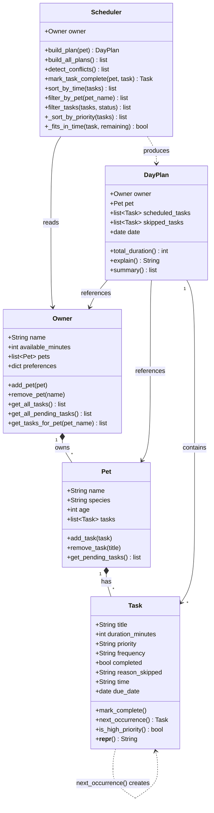

# PawPal+ Project Reflection

## 1. System Design

**a. Initial design**

Classes I chose and their responsibilities:

- **`Owner`** — holds the human side of the relationship: name, how many minutes are available today, and any scheduling preferences (e.g. prefers morning walks). It is the primary constraint source for the scheduler.
- **`Pet`** — holds the animal's profile (name, species, age) and a reference to its owner. It carries context the scheduler may use to personalize the plan (e.g. a senior dog needs shorter walks).
- **`Task`** — represents a single care activity. It stores what needs to happen (`title`), how long it takes (`duration_minutes`), how important it is (`priority`), whether it was done (`completed`), and if skipped, why (`reason_skipped`). It is the unit the scheduler operates on.
- **`DayPlan`** — the output of a scheduling run. It holds the ordered list of scheduled tasks, the list of skipped tasks (with reasons), and references to the owner and pet so the plan can be personalized. It also provides `explain()` to surface reasoning.
- **`Scheduler`** — the only class with real logic. It takes an `Owner` and `Pet` as context, receives a list of `Task` objects, sorts by priority, greedily fits tasks into the available time window, and returns a `DayPlan`.

### UML Class Diagram (Final)

**b. Design changes**

After reviewing the skeleton in `pawpal_system.py`, I made three changes based on gaps identified in the initial design:

1. **Removed `Pet.get_species()` and `Owner.set_available_minutes()`** — The initial UML included getter/setter methods copied from object-oriented conventions in languages like Java. In Python, dataclass attributes are public by default, so these methods added no value and created unnecessary noise. Removing them keeps the classes idiomatic.

2. **Added `owner` and `pet` references to `DayPlan`** — The original `DayPlan` had no reference to who the plan belonged to. This meant `explain()` could not say "Here is Mochi's plan for Jordan" or use the pet's species to personalize reasoning. Adding these references gives `DayPlan` the context it needs to produce meaningful output without needing to be passed extra arguments at call time.

3. **Added `reason_skipped: str` to `Task`** — The original design stored skipped tasks in `DayPlan.skipped_tasks` but had no way to record *why* a task was skipped (not enough time remaining? lowest priority when time ran out?). Adding `reason_skipped` lets the `Scheduler` annotate each skipped task before placing it in the list, so `explain()` can report meaningful reasons rather than just listing omitted tasks.

---

## 2. Scheduling Logic and Tradeoffs

**a. Constraints and priorities**

The scheduler considers four constraints, in this order of importance:

1. **Time** (`available_minutes`) — the hardest constraint. No task can be added to the plan if it would push total duration past this limit. It cannot be negotiated around.
2. **Priority** (`high` / `medium` / `low`) — determines the order tasks are evaluated. High-priority tasks (feeding, walks) are always considered before medium or low ones.
3. **Frequency** (`daily` / `weekly`) — daily tasks are evaluated before weekly tasks within each priority tier. This prevents a low-urgency weekly chore from consuming time that a daily task needs.
4. **Duration** — used as a tiebreaker within the same priority tier. Shorter tasks are scheduled first, which maximizes the number of tasks that fit in the available window (a greedy optimization).

Time was treated as the hardest constraint because it is the only one that is truly fixed — you cannot manufacture more minutes in a day. Priority and frequency reflect urgency and health impact, which are the next most important factors for a pet care context.

**b. Tradeoffs**

**Exact time-match vs. duration-overlap detection**

The scheduler's conflict detection (`detect_conflicts`) only flags tasks that share the exact same `time` string (e.g., both at `"08:00"`). It does *not* check whether a 30-minute task starting at `07:45` overlaps with a 10-minute task starting at `08:00`.

This tradeoff is reasonable for this scenario because: (1) exact-match detection is O(n) and requires no interval math; (2) for a home pet-care schedule, tasks are typically short and spaced deliberately — the owner sets the times themselves; (3) a warning-not-crash approach means false negatives (missed overlaps) are acceptable, while false positives (phantom conflicts from interval logic bugs) would be more disruptive. Extending to full interval overlap detection is a clear next step if task durations grow or time windows become tighter.

**AI suggestion considered — `defaultdict` vs. `setdefault`**

When evaluating the time-slot bucketing code in `detect_conflicts()`, a more Pythonic version using `collections.defaultdict` was considered. It saves two lines and removes the explicit `setdefault` call. The current `dict.setdefault` version was kept because it requires no extra import, is readable to anyone who knows standard Python dicts. When readability and a simpler import footprint tie with a minor style gain, readability wins.

---

## 3. AI Collaboration

**a. How you used AI**

AI tools (VS Code Copilot) were used across every phase of the project, but in different modes depending on what was needed:

- **Inline Chat** was most effective for small, targeted problems — asking "how should I sort these strings in HH:MM format?" or "what key should I use in sorted() to get priority then duration?" The answers were narrow, verifiable, and directly usable.
- **Agent Mode** handled larger feature implementations where multiple methods needed to be added at once — for example, wiring up recurring task logic across `Task.next_occurrence()`, `Scheduler.mark_task_complete()`, and the `main.py` demo in one pass.
- **Chat with `#codebase`** was most useful for cross-file reasoning — asking for a test plan or a README features list where the answer needed to reflect the actual implementation rather than generic advice.

The most effective prompts were specific and code-grounded: *"In my Scheduler class, how could detect_conflicts be simplified for readability?"* produced a focused, reviewable answer. Broad prompts like *"improve my code"* were less useful because the suggestions weren't anchored to actual design constraints.

**b. Judgment and verification**

The clearest moment of not accepting an AI suggestion as-is was the `defaultdict` vs. `setdefault` decision in `detect_conflicts()`. Copilot suggested replacing the `dict.setdefault` pattern with `collections.defaultdict(list)`, which is marginally shorter. The suggestion was reviewed by asking: *who is the audience for this code, and does the gain justify the added import?* For a student-level project where the reader may not know `defaultdict`, `setdefault` on a plain dict is more transparent. The AI suggestion was technically correct but optimized for the wrong goal — conciseness over clarity. The original version was kept.

The verification step was reading both versions side by side and mentally running them with a small input to confirm they produced identical output. Once equivalence was confirmed, the choice became purely about readability.

**c. Separate chat sessions**

Opening a new chat session for each phase (design, algorithm implementation, testing, documentation) prevented earlier context from "leaking" into unrelated decisions. When the testing session asked *"what are the most important edge cases for a pet scheduler?"*, Copilot gave answers grounded in the testing problem — not influenced by earlier implementation discussions. It also made it easier to evaluate suggestions objectively, since each session started without accumulated assumptions from previous phases.

---

## 4. Testing and Verification

**a. What you tested**

The test suite covers five behavioral categories across 18 tests:

- **Sorting** — `sort_by_time()` returns tasks in chronological HH:MM order; untimed tasks are placed last; `build_plan()` schedules high-priority before low; shorter tasks come first within the same priority tier.
- **Recurrence** — completing a daily task creates a new task due tomorrow via `timedelta(days=1)`; weekly creates one due in 7 days; `as-needed` returns `None` and adds nothing to the pet.
- **Conflict detection** — duplicate start times produce a warning string; different times do not; total high-priority task time exceeding available minutes triggers a budget warning.
- **Edge cases** — a pet with no tasks produces an empty plan with no crashes; a task that doesn't fit remaining time appears in `skipped_tasks`; `filter_tasks` correctly separates pending from completed.
- **Baseline** — `mark_complete()` flips the `completed` flag; `add_task()` increases the pet's task count.

These tests matter because the scheduling logic involves multiple interacting rules (priority, frequency, duration, time budget) that are easy to get subtly wrong. A test that passes in isolation doesn't prove the rules compose correctly under real conditions — the edge case and sorting tests catch exactly that.

**b. Confidence**

**★★★★☆ (4/5)**

All algorithmic paths in `pawpal_system.py` are covered: every branch in `build_plan()`, both recurrence paths, all three conflict checks, and both filter modes. Confidence is not at 5 stars because the Streamlit UI layer in `app.py` has no automated tests — session state interactions, form submissions, and the conflict warning display are only verified manually. Adding Streamlit integration tests (using `streamlit.testing.v1`) would close that gap.

---

## 5. Reflection

**a. What went well**

The layered build order worked well: data model first (`Task`, `Pet`, `Owner`), then scheduling logic (`Scheduler`, `DayPlan`), then UI (`app.py`), then tests. Each layer could be validated independently before the next was added. This meant that when the UI section was built, the underlying logic was already proven correct, so UI bugs and logic bugs were never confused with each other.

The decision to keep all intelligence in `Scheduler` (rather than spreading logic into `Pet` or `Task`) also paid off — every new feature (sort, filter, conflict detection, recurrence) had a clear home, and the data classes stayed simple.

**b. What you would improve**

Two things stand out for a next iteration:

1. **Duration-overlap conflict detection** — the current system only flags exact time matches. A 30-minute task at 07:45 and a 10-minute task at 08:00 genuinely overlap, but the system misses it. Replacing the string-equality check with an interval comparison (`start_time + duration > other_start_time`) would make conflict detection meaningfully more useful without much added complexity.

2. **Persistent storage** — tasks and pets entered in the Streamlit app are lost on page reload because they live only in `st.session_state`. Adding a lightweight JSON file or SQLite backend would make the app usable across sessions without introducing a heavy database dependency.

**c. Key takeaway**

The most important thing learned: **AI is a fast implementer, not an architect.** Copilot can write a correct method in seconds, but it doesn't know whether that method belongs in `Task` or `Scheduler`, whether the tradeoff favors readability over performance, or whether a suggested abstraction will cause problems three features later. Every AI-generated suggestion in this project had to be evaluated against the system's design goals before accepting it. The value of AI collaboration came from that combination — AI handles the mechanical work of writing code, the developer handles the judgment calls about *what* to build and *where* it belongs. Giving up that judgment role would have produced a working but incoherent system.

---
